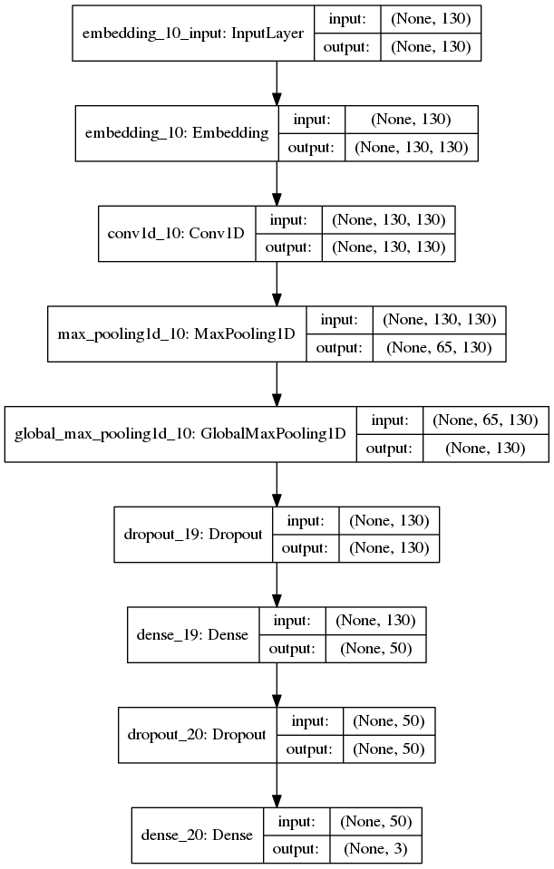

# deep authorship attribution

A multi-class text classification based on a deep recurrent neural network (RNN) with convolutional units. 

## Features:
- The network includes an embedding layer, so the input is first transformed into padded sequences of fixed length. 
- PoS-tagging and additional feature engineering is also included to improve classification, but is not essential for the network to run.

## Performance:
- 89% accuracy on an example corpus from Kaggle Spooky Author Identification challenge (https://www.kaggle.com/c/spooky-author-identification)

## Network architecture

Version: 0.3

Author: Michal Pikusa (pikusa.michal@gmail.com)

